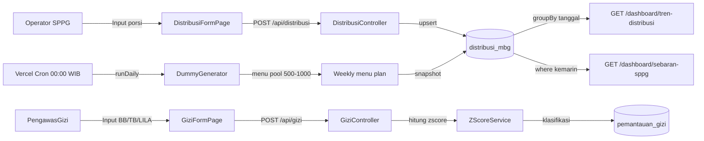

# Fitur 1: Nilai Gizi & List Makanan Weekly per SPPG

> **SRS Reference**: REQ-4.1, REQ-4.4, REQ-5.1, REQ-5.2, REQ-5.3, REQ-5.4, REQ-5.5, REQ-5.6
> **Prioritas**: High

---

## Overview

Fitur ini memungkinkan SPPG untuk:
1. Mencatat **distribusi harian** (porsi per kategori penerima) per SPPG.
2. Menghasilkan **menu weekly** (7 hari, Senin–Minggu) yang konsisten dengan kapasitas SPPG dan proporsi kategori penerima.
3. Menghitung **Z-score WHO** untuk data antropometri (BB, TB, LILA) penerima.
4. Mengklasifikasikan **status gizi** (GIZI_BURUK / GIZI_KURANG / GIZI_BAIK / GIZI_LEBIH).
5. Menampilkan tren **distribusi MBG** per hari (7/30/90 hari) di dashboard.

---

## Implementasi Teknis

### Backend

#### 1. Distribusi MBG Harian

- **File**: [backend/src/services/dummyNutrition.service.js](../../backend/src/services/dummyNutrition.service.js)
- **Endpoint**: `POST /api/distribusi` ([backend/src/routes/distribusi.routes.js](../../backend/src/routes/distribusi.routes.js))
- **Alur**:
  1. Validasi user role (OPERATOR_SPPG, ASISTEN_LAPANGAN, ADMIN).
  2. Cek `tanggalDistribusi ≤ hari ini` (BR-2: max H-3 kecuali ADMIN).
  3. Cek `totalPorsi ≤ 120% kapasitas SPPG`.
  4. `upsert` ke `distribusi_mbg` (unique `[sppgId, tanggalDistribusi]`).
  5. Audit trail via `catatAudit({tabel:"distribusi_mbg", ...})`.

#### 2. Menu Weekly Generator

- **File**: [backend/src/services/dummyNutrition.service.js](../../backend/src/services/dummyNutrition.service.js)
- **Functions**:
  - `BASE_INGREDIENT_CATALOG`: 100 bahan (karbo, protein hewani/nabati, sayur, buah, pelengkap) dengan nilai gizi per 100g.
  - `buildMenuPool(totalMenus)`: generate `totalMenus` menu unik dari katalog.
  - `buildWeeklyMenuPlanForSppg(sppgId, weekKey, menuPool)`: generate 7 menu (Senin–Minggu) per SPPG. Seed `hashString(sppgId + weekKey + dayKey)` agar menu deterministik per SPPG per minggu.
  - `buildSyntheticMenuSnapshotForSppg({sppgId, date, totalMenus:1000})`: snapshot menu harian + mingguan.
  - **Acuan Isi Piringku**: 50% sayur+buah, 50% karbo+protein (standar Kemenkes).
  - Komposisi menu: 1 karbo, 1 protein hewani, 1 protein nabati, 1-2 sayur, 1 buah, 75% ada pelengkap.

#### 3. Z-Score WHO

- **File**: [backend/src/services/zscore.service.js](../../backend/src/services/zscore.service.js)
- **Acuan**: WHO 2006 (balita 0-59 bulan) & WHO 2007 (anak sekolah) — tabel LMS di [backend/src/data/who/](../../backend/src/data/who/)
- **Formula**: Z = ((y/M)^L - 1) / (L × S)
- **Endpoint**: `POST /api/gizi`
- **Klasifikasi** (REQ-5.3):
  - `Z < -3`: GIZI_BURUK
  - `-3 ≤ Z < -2`: GIZI_KURANG
  - `-2 ≤ Z ≤ +2`: GIZI_BAIK
  - `Z > +2`: GIZI_LEBIH
  - `TB/U < -2`: flag stunting (REQ-5.6)
- **Validasi rentang** (BR-3): BB 0-300 kg, TB 30-250 cm, LILA 5-50 cm.

#### 4. Cron Harian + Vercel Schedule

- **File**: [vercel.json](../../vercel.json)
- `crons`: `[{"path": "/api/cron/daily-generate", "schedule": "0 17 * * *"}]` (= 00:00 WIB)
- **Handler**: [backend/src/controllers/cron.controller.js](../../backend/src/controllers/cron.controller.js)
- **Mode realistic** (default cron): nasional 1.000-1.000.000 porsi/hari
- **Mode absurdly_high** (default UI trigger): util 35-90% kapasitas (chart besar untuk demo)
- **Steps paralel**: dummy + realtime + public via `Promise.allSettled` (1 gagal tidak stop step lain)

---

### Frontend

#### 1. DistribusiListPage ([frontend/src/pages/DistribusiListPage.jsx](../../frontend/src/pages/DistribusiListPage.jsx))

- Tabel distribusi per SPPG dengan filter (tanggal, SPPG, status, kategori).
- Card ringkasan (Total Porsi, SPPG Lapor, dll).
- Tombol "Import Distribusi" (admin only).

#### 2. DistribusiFormPage ([frontend/src/pages/DistribusiFormPage.jsx](../../frontend/src/pages/DistribusiFormPage.jsx))

- Form input porsi per kategori: PD, Balita, Hamil, Menyusui.
- Validasi: total ≤ 120% kapasitas SPPG.
- Upload foto bukti (multer).
- Status otomatis: DRAFT / TERKONFIRMASI / TERVALIDASI.

#### 3. GiziFormPage ([frontend/src/pages/GiziFormPage.jsx](../../frontend/src/pages/GiziFormPage.jsx))

- Form input antropometri (BB, TB, LILA, usia bulan).
- Auto-kalkulasi Z-score dan klasifikasi.
- Tampilan riwayat pengukuran per penerima.

#### 4. DashboardPage - Tren Distribusi

- **File**: [frontend/src/pages/DashboardPage.jsx](../../frontend/src/pages/DashboardPage.jsx)
- Area chart Recharts: `distribusi_mbg` groupBy `tanggalDistribusi` (7/30/90 hari)
- Backend: [backend/src/controllers/dashboard.controller.js](../../backend/src/controllers/dashboard.controller.js) `getTrenDistribusi`

---

## Alur Data (Mermaid)

---

## Cara Test Manual

1. Login admin -> `http://bgn-xi.vercel.app`
2. Buka **Distribusi MBG** -> klik **+ Input Distribusi** -> pilih SPPG, tanggal, isi porsi
3. Submit -> data muncul di list, terhitung di `distribusiMbg.totalPorsi`
4. Buka **Dashboard** -> chart tren 7 hari naik dengan data hari ini
5. Buka **Status Gizi** -> input pengukuran -> lihat Z-score & klasifikasi otomatis

---

## FAQ untuk Dosen

**Q: Z-score WHO dipakai yang mana?**
A: Tabel LMS WHO 2006 (untuk balita 0-59 bulan) & WHO 2007 (untuk anak sekolah). Tabel disimpan di `backend/src/data/who/*.json` (tidak dimodifikasi runtime sesuai REQ-5.4 & BR-4).

**Q: Kenapa pakai Acuan Isi Piringku?**
A: 50% sayur+buah, 50% karbo+protein adalah standar Kemenkes RI untuk menu MBG. Komposisi menu generator mengikuti proporsi ini agar menu harian realistis.

**Q: Bagaimana data weekly menu disimpan?**
A: Disimpan di field `catatan` (JSON) per row distribusi. Schema sederhana, tidak perlu tabel menu terpisah. Menu deterministik per SPPG per minggu (seeded hash).

**Q: Kenapa cron Vercel pakai mode realistic bukan demo?**
A: Mode realistic (1.000-1.000.000/hari nasional) lebih representatif untuk produksi. Mode demo (`absurdly_high`) dipakai oleh tombol UI untuk visualisasi chart besar saat presentasi.
