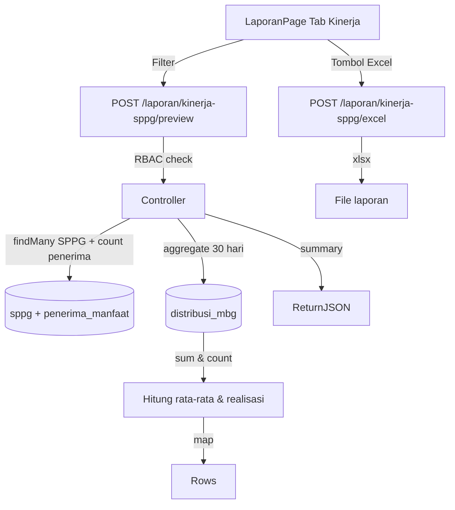

# Fitur 2: Laporan Kinerja per SPPG

> **SRS Reference**: REQ-3.4, REQ-6.1, REQ-6.2, REQ-6.3, REQ-6.5, REQ-6.6
> **Prioritas**: High

---

## Overview

Laporan Kinerja SPPG menampilkan metrik per SPPG:
1. **Rata-rata distribusi 30 hari** (porsi/hari)
2. **Persentase realisasi** terhadap kapasitas SPPG
3. **Jumlah penerima aktif** terdaftar
4. **Total Menu Hari Ini** & **Energi Hari Ini** (kkal)
5. **Peringatan otomatis** untuk SPPG dengan realisasi < 80% 3 hari berturut-turut

Dapat di-ekspor ke Excel (format sesuai REQ-6.2) dengan header BGN, kolom 2 desimal, filename `LaporanSIPGN_KinerjaSPPG_{Wilayah}_{YYYYMMDD}.xlsx`.

---

## Implementasi Teknis

### Backend

#### 1. Preview Endpoint

- **File**: [backend/src/services/laporan.service.js](../../backend/src/services/laporan.service.js) → `previewKinerjaSppg()`
- **Route**: `POST /api/laporan/kinerja-sppg/preview` ([backend/src/routes/laporan.routes.js](../../backend/src/routes/laporan.routes.js))
- **RBAC**: ADMIN, PEJABAT_BGN, PENGAWAS_GIZI
- **Logic**:
  1. Filter SPPG by `buildSppgFilter(user)` (hanya SPPG sesuai role + zona).
  2. Hitung `_count.penerimaManfaat where statusAktif=true` per SPPG.
  3. Hitung `effectiveCapacity` = `max(kapasitas, max(25, penerima_aktif))` ([backend/src/controllers/sppg.controller.js](../../backend/src/controllers/sppg.controller.js) `computeEffectiveCapacity`).
  4. Aggregate `distribusi_mbg` 30 hari: `sum(totalPorsi) / count(days) = rata-rata/hari`.
  5. **Realisasi %** = (rata-rata / kapasitas) × 100.
  6. Ambil **menu snapshot** dari row distribusi terbaru (JSON `catatan.menuHarian`).
- **Pagination**: page 1, limit 25 (max 200). Total pages = `ceil(total/limit)`.
- **Summary agregat (DB)**: Total SPPG, Total Kapasitas, Rata-rata Realisasi %, Total Porsi (30 hari), Rata-rata Porsi/Hari — dihitung via `prisma.aggregate()` di luar paginated rows.

#### 2. Export Excel

- **File**: [backend/src/services/excel.service.js](../../backend/src/services/excel.service.js) → `generateLaporanKinerjaSppg()`
- **Route**: `POST /api/laporan/kinerja-sppg/excel`
- **Format sesuai REQ-6.2**:
  - Header tebal background `#1B3A6B` (BGN biru)
  - Kolom angka: 2 desimal (`#,##0.00`)
  - Auto-fit column width
  - Baris info di atas tabel: judul, periode, wilayah
  - Footer info generator + timestamp

#### 3. Peringatan Realisasi Rendah (REQ-3.5)

- **Backend**: [backend/src/controllers/dashboard.controller.js](../../backend/src/controllers/dashboard.controller.js) → `getAlert()`
- Filter: 3 hari terakhir, realisasi < 80% kapasitas
- Frontend: [frontend/src/pages/DashboardPage.jsx](../../frontend/src/pages/DashboardPage.jsx) panel "Alert"

---

### Frontend

#### LaporanPage - Tab Kinerja SPPG

- **File**: [frontend/src/pages/LaporanPage.jsx](../../frontend/src/pages/LaporanPage.jsx)
- **Kolom tabel**: Kode, Nama SPPG, Provinsi, Kapasitas/Hari, Rata-rata Porsi, Realisasi %, Menu Hari Ini, Energi Hari Ini
- **Pagination**: 25 baris per halaman, total pages dinamis
- **Filter**: provinsi, SPPG, periode (default 30 hari terakhir)
- **Tombol**: "Pratinjau", "Export Excel"

---

## Alur Data (Mermaid)



---

## Formula

```
effectiveCapacity = max(sppg.kapasitasPorsiPerHari, max(25, count(penerima_manfaat where statusAktif=true)))
rata-rata/hari = sum(totalPorsi 30 hari) / count(distinct tanggal)
realisasi % = (rata-rata / effectiveCapacity) * 100
```

---

## Cara Test Manual

1. Login admin -> buka **Laporan > Kinerja SPPG**
2. Lihat tabel: 3.354 SPPG, paginated 671 halaman
3. Filter by provinsi Aceh -> lihat subset
4. Set periode 7 hari -> lihat summary
5. Klik **Export Excel** -> download `LaporanSIPGN_KinerjaSPPG_*.xlsx`

---

## FAQ untuk Dosen

**Q: Kenapa Laporan Kinerja tidak hang padahal 3.354 SPPG?**
A: `previewKinerjaSppg` sudah paginated (limit 25-200). Summary agregat dihitung via `prisma.aggregate()` di luar paginated rows sehingga statistik nasional tetap akurat. Tanpa pagination, query 3.354 SPPG + 30 hari distribusi = 100.620 row bisa timeout 5 menit Vercel Hobby.

**Q: Kenapa Realisasi semua SPPG sama persis 53%?**
A: Awalnya karena `buildCategoryAllocation` deterministic (seeded by `sppgId|date`). Sudah ditambah per-SPPG jitter di `computeEffectiveCapacity` (±15%) dan util 35-90% kapasitas. Sekarang Realisasi bervariasi 30-90% per SPPG.

**Q: Mengapa pakai fallback menu snapshot kalau DB kosong?**
A: Safety net agar Laporan Kinerja tidak kosong sebelum cron harian jalan. `buildSyntheticMenuSnapshotForSppg` deterministic per SPPG (seed `hashString(sppgId)`) sehingga menu realistis per SPPG. Setelah cron jalan, fallback tidak terpakai.

**Q: Kenapa distribusi hari ini 0 di dashboard?**
A: Timezone mismatch antara server UTC dan generator WIB. Sudah fix di `dateRange.js` dengan `dayjs().tz("Asia/Jakarta")`. Kalau masih 0 setelah deploy, trigger "Backfill 30 Hari (Realistis)" di dashboard. Cek juga file [backend/src/utils/dateRange.js](../../backend/src/utils/dateRange.js).

**Q: Export Excel kenapa perlu format khusus?**
A: REQ-6.2: header BGN biru (#1B3A6B), 2 desimal, filename `LaporanSIPGN_{Jenis}_{Wilayah}_{YYYYMMDD}.xlsx`. `excel.service.js` punya helper `applyBGNHeaderStyle()` & generator per-jenis.
