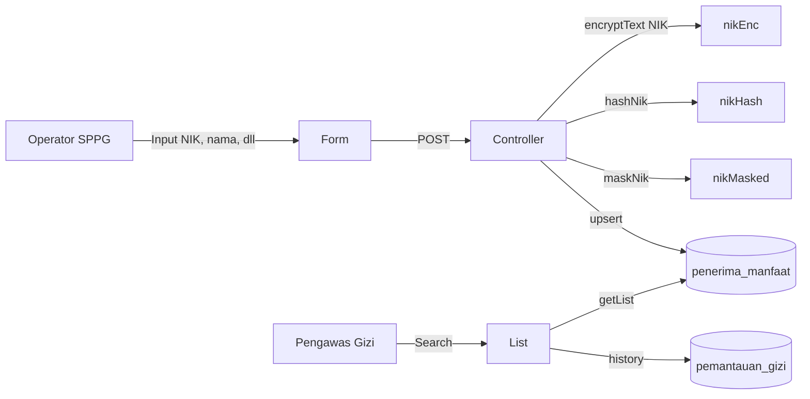

# Fitur 3: Manajemen Penerima Manfaat

> **SRS Reference**: REQ-2.1, REQ-2.2, REQ-2.4, REQ-2.5, REQ-2.6
> **Prioritas**: High

---

## Overview

Manajemen data penerima manfaat MBG dengan kategori:
1. **PESERTA_DIDIK** — PAUD s.d. SMA/SMK/pesantren
2. **BALITA** — 0-59 bulan
3. **IBU_HAMIL** — ibu mengandung
4. **IBU_MENYUSUI** — ibu menyusui

Dilengkapi: validasi NIK 16 digit, NIK terenkripsi (AES-256-GCM), hash HMAC-SHA256 untuk lookup, soft delete, full-text search, dan laporan Excel.

---

## Implementasi Teknis

### Backend

#### 1. Schema Database

- **File**: [backend/prisma/schema.prisma](../../backend/prisma/schema.prisma)
- **Model** `PenerimaManfaat`:
  - `nikEnc` (TEXT, AES-256-GCM encrypted NIK asli)
  - `nikHash` (VARCHAR(64), HMAC-SHA256 hex untuk search)
  - `nikMasked` (VARCHAR(20), tampilan "1234********9012")
  - `namaLengkap`, `tanggalLahir`, `jenisKelamin`, `kategori`, `satuanPendidikan`
  - FK `sppgId`
  - **Unique** `@@unique([nikHash, sppgId])` (REQ-2.2: anti-duplikasi per SPPG)

#### 2. Enkripsi NIK (UU PDP No. 27/2022)

- **File**: [backend/prisma/seed.js](../../backend/prisma/seed.js) (helper `encryptText`, `hashNik`, `maskNik`)
- Algoritma: AES-256-GCM dengan IV random 12 byte + auth tag, key derived SHA-256 dari `DATA_ENCRYPTION_KEY`
- HMAC-SHA256 untuk lookup aman (deterministic, indexed, tidak expose NIK asli)

#### 3. Endpoint

- **File**: [backend/src/routes/penerima.routes.js](../../backend/src/routes/penerima.routes.js)
- `GET /api/penerima` — list + search + filter + pagination
- `POST /api/penerima` — create (RBAC: ADMIN, OPERATOR_SPPG)
- `PUT /api/penerima/:id` — update
- `DELETE /api/penerima/:id` — soft delete (`statusAktif=false`)
- `GET /api/penerima/:id` — detail
- `GET /api/penerima/template-excel` — template import
- `POST /api/penerima/import` — bulk import Excel
- `GET /api/gizi/penerima/:penerimaId` — riwayat gizi per penerima

#### 4. Validasi Usia (REQ-2.6)

- Backend otomatis hitung usia dari `tanggalLahir` vs `tanggalPengukuran`
- Z-score lookup sesuai kategori usia: 0-59 bulan (WHO 2006) atau 6-18 tahun (WHO 2007)

---

### Frontend

#### PenerimaListPage ([frontend/src/pages/PenerimaListPage.jsx](../../frontend/src/pages/PenerimaListPage.jsx))

- Tabel dengan search bar (nama, NIK masked, kategori)
- Filter: kategori, SPPG, status aktif
- Pagination 50 data/halaman (REQ-2.4)
- Tombol "+ Tambah", "Import Excel", "Edit", "Hapus (soft)"

#### PenerimaFormPage ([frontend/src/pages/PenerimaFormPage.jsx](../../frontend/src/pages/PenerimaFormPage.jsx))

- Form dengan NIK, nama, tanggal lahir, jenis kelamin, kategori, satuan pendidikan
- Validasi NIK 16 digit (real-time)
- Auto-hitung usia dari tanggal lahir

#### PenerimaDetailPage ([frontend/src/pages/PenerimaDetailPage.jsx](../../frontend/src/pages/PenerimaDetailPage.jsx))

- Profil penerima + riwayat gizi (chart pertumbuhan WHO)
- Riwayat distribusi yang diterima

---

## Alur Data (Mermaid)

---

## Cara Test Manual

1. Login admin -> buka **Penerima Manfaat**
2. Klik **+ Tambah Penerima** -> isi NIK 16 digit, nama, tanggal lahir, kategori
3. Submit -> data muncul dengan `1234********5678` (masked NIK)
4. Buka detail -> lihat chart pertumbuhan WHO
5. Search NIK atau nama -> find row dengan NIK mask
6. Test soft delete: edit status aktif -> off -> row hilang dari list aktif tapi ada di filter "nonaktif"

---

## FAQ untuk Dosen

**Q: Kenapa NIK dienkripsi?**
A: UU PDP No. 27/2022 mewajibkan data pribadi sensitif dienkripsi. Kami pakai AES-256-GCM (standar industri, authenticated encryption). Untuk lookup/search yang butuh pencocokan NIK, kami pakai HMAC-SHA256 deterministic hash yang di-index. Tampilan di UI selalu masked (`1234********5678`).

**Q: Kenapa butuh `nikHash` (HMAC) dan `nikEnc` (AES)?**
A: AES-GCM itu authenticated encryption, **tidak bisa dipakai untuk equality lookup** (setiap encryption hasilkan ciphertext beda karena IV random). HMAC-SHA256 deterministic memungkinkan index-based search tanpa expose NIK asli. Index `@@unique([nikHash, sppgId])` di level DB.

**Q: Bagaimana cara hitung usia otomatis?**
A: Backend hitung dari `tanggalLahir` vs `tanggalPengukuran` (atau `Date.now()`), convert ke bulan untuk Z-score. GIZI_KURANG/BAIK/LEBIH/BURUK berdasarkan Z-score (REQ-5.3). Stunting flag = TB/U < -2 SD (REQ-5.6).

**Q: Soft delete vs hard delete?**
A: BR-2 & REQ-2.5: data penerima yang dinonaktifkan (`statusAktif=false`) TIDAK hilang dari database, hanya tersembunyi dari daftar aktif. Untuk audit trail & histori gizi, penting menyimpan data meski sudah non-aktif.

**Q: Import Excel dari mana formatnya?**
A: Template di `GET /api/penerima/template-excel` mengikuti kolom CSV: `nik, nama_lengkap, tanggal_lahir, jenis_kelamin, kategori, satuan_pendidikan`. Validasi NIK + duplikat per SPPG saat import.

**Q: Bagaimana data dummy nama Indonesia realistic?**
A: Service `namaGenerator.js` punya pool 50+ nama depan (Andi, Budi, Citra, Dewi, ...) + 50+ nama keluarga Indonesia (Wijaya, Pratama, Saputra, ...) + prefix (Muhammad, Siti, ...). Seeded random dari `sppgId + index` agar deterministik per SPPG. Dipakai juga untuk nama fallback di Laporan Status Gizi.
