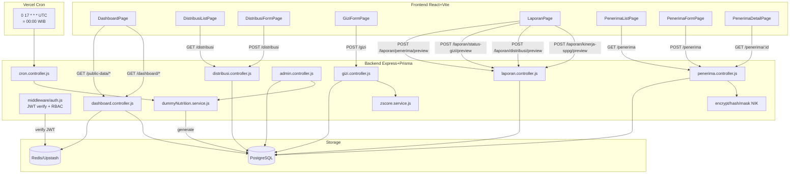

# Alur Data Lintas Page

Diagram alur data untuk fitur-fitur Kelompok 2: Nilai Gizi, Laporan Kinerja, Penerima Manfaat.

## Arsitektur End-to-End

## Sumber Data per Page

| Page | Endpoint | Tabel DB | Fungsi |
|------|----------|----------|--------|
| Dashboard Statistik | `GET /api/dashboard/statistik` | `distribusi_mbg`, `sppg`, `penerima_manfaat` | Aggregate hari ini, kemarin, total |
| Dashboard Tren 7/30 Hari | `GET /api/dashboard/tren-distribusi?range=7` | `distribusi_mbg` | groupBy `tanggalDistribusi` |
| Dashboard Alert | `GET /api/dashboard/alert` | `distribusi_mbg`, `pemantauan_gizi` | SPPG belum lapor, realisasi rendah |
| Dashboard Realtime | `GET /api/public-data/realtime-summary` | `realtime_metric` | 5 metric keys, delta hari ini |
| Distribusi List | `GET /api/distribusi?status=TERVALIDASI&tanggalAkhir=...` | `distribusi_mbg` | Filter by date + SPPG + status |
| SPPG List | `GET /api/sppg?limit=25` | `sppg`, `distribusi_mbg` | Paginated + distribusi kemarin |
| SPPG Detail | `GET /api/sppg/:id` | `sppg`, `penerima_manfaat`, `distribusi_mbg` | 30 hari tren + menu |
| Laporan Distribusi | `POST /api/laporan/distribusi/preview` | `distribusi_mbg` | Filter periode + wilayah |
| Laporan Status Gizi | `POST /api/laporan/status-gizi/preview` | `pemantauan_gizi` | Z-score agregat per kategori |
| Laporan Kinerja SPPG | `POST /api/laporan/kinerja-sppg/preview` | `sppg`, `distribusi_mbg` | Paginated, summary agregat DB |
| Laporan Penerima | `POST /api/laporan/penerima/preview` | `penerima_manfaat` | Filter + paginated |

## Bagaimana Data Tetap Sinkron Lintas Page

1. **Single source of truth**: `distribusi_mbg`, `pemantauan_gizi`, `penerima_manfaat` di PostgreSQL. Tidak ada duplikasi.
2. **Cache invalidation**: `cron.controller.js` panggil `invalidatePrefix("dashboard:")` & `invalidatePrefix("laporan:")` setelah trigger generator. Cache TTL 5 menit. Setelah deploy, refresh browser = data konsisten.
3. **Timezone konsistensi**: Cron pakai `dayjs().tz("Asia/Jakarta")` untuk konsistensi antar SPPG timezone. Query distribusi pakai window 2 hari (UTC + Jakarta) untuk toleransi.
4. **Idempotent upsert**: distribusi_mbg pakai unique `[sppgId, tanggalDistribusi]` + `upsert`. Backfill aman di-rerun.
5. **Skip duplicates**: createMany dengan `skipDuplicates: true` untuk penerima backfill.

## Cron Schedule

```mermaid
gantt
  title Vercel Cron Schedule (Asia/Jakarta)
  dateFormat HH:mm
  axisFormat %H:%M
  section Harian
    Sinkronisasi harian (dummy + realtime + public)   :00:00, 5m
```

Walau Hobby limit 1x/hari, frontend tombol "Trigger Cron (Semua)" bisa jalan kapan saja via API. Tombol "Backfill 30 Hari (Realistis)" & "Reset Data Dummy" untuk admin via `/api/cron/backfill-30d` & `/api/admin/reset-distribusi`.
